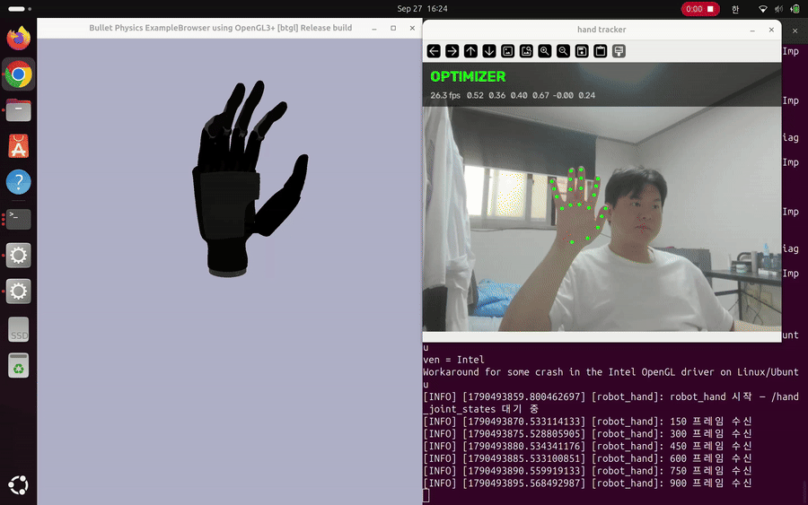

# 웹캠 기반 로봇 손 실시간 리타게팅

노트북 웹캠으로 사람 손을 인식해 PyBullet 속 로봇 손(Inspire Hand, 6자유도)을 실시간으로 따라 움직이게 하는 ROS2 시스템입니다.
손가락이 가려져 인식이 끊기는 구간은 학습 모델이 직전 움직임으로 이어받습니다.



> 왼쪽: 손 인식 화면 (`OPTIMIZER` = 손 인식 중, `POLICY gap N` = 인식이 끊긴 뒤 N프레임째 학습 모델이 이어받는 중)
> 오른쪽: PyBullet 로봇 손

**MediaPipe · dex-retargeting · ROS2 Jazzy · PyBullet · PyTorch** — GPU 없이 노트북 CPU 단일 환경

---

## 결과

### 인식이 끊긴 구간 복원 오차 (MAE, rad)

| 끊긴 길이 | 마지막 값 유지 | 선형 외삽 | **학습 모델 (최종)** | 개선 |
|---|---|---|---|---|
| 5프레임 | 0.0737 | 0.1180 | **0.0627** | 15.0 % |
| 10프레임 | 0.1417 | 0.2490 | **0.1178** | 16.9 % |
| 20프레임 | 0.1916 | 0.4094 | **0.1737** | 9.3 % |
| 40프레임 | 0.2522 | 0.7279 | **0.2325** | 7.8 % |

- 평가 방법: 테스트 세션에서 **손이 정상 인식된 구간을 일부러 N프레임 가리고**, 모델 예측을 실제 관절값과 비교했습니다. 실제로 가려진 구간은 정답 관절값이 없어 직접 평가할 수 없기 때문입니다.
- 손 동작은 선형 외삽이 오히려 마지막 값 유지보다 나빴습니다.

### 처리 시간

| 단계 | 시간 |
|---|---|
| 손 인식 (MediaPipe) | 약 24 ms |
| 로봇 관절 각도 계산 | 2.1 ms (p95 4.3 ms) |
| 학습 모델 추론 | 0.09 ms |

처리량은 실행 조건에 따라 **23~29 Hz**입니다 (시뮬레이터 동시 실행 29.4 Hz / 트래커 단독 23.4 Hz). 한 프레임 시간의 대부분은 손 인식 단계입니다.

---

## 구조

```
웹캠 ─▶ MediaPipe (손 관절 21점, 3D)
          │
          ├─ 인식됨 ──▶ 손 좌표계 정규화 ─▶ 로봇 관절 각도 계산 (dex-retargeting) ─┐
          │                                                                      ├─▶ 범위 보정 ─▶ ROS2 ─▶ PyBullet
          └─ 끊김 ────▶ 학습 모델: 직전 16프레임 → 이후 40프레임 변화량 예측 ────────┘
```

| 노드 | 역할 | 토픽 |
|---|---|---|
| `hand_tracker` | 손 인식, 관절 각도 계산, 끊김 구간 예측 | `/hand_joint_states` (관절), `/hand_pose` (손 방향) |
| `robot_hand` | PyBullet 로봇 손 제어 | 위 두 토픽 구독 |

---

## 설계에서 내린 판단

**1. 학습 모델을 어디에 쓸지 — 측정으로 결정**
처음에는 학습 모델로 관절 각도 계산 자체를 대체하려 했습니다. 측정해 보니 계산은 2.1 ms로 프레임 예산(33 ms)의 6 %에 불과했고, 출력 떨림도 지연 없는 필터(EMA)로 충분히 줄었습니다. 그래서 학습 모델은 **계산 자체가 불가능한 구간, 즉 손이 가려져 인식이 끊긴 구간**에만 쓰도록 바꿨습니다.

**2. 절대 각도가 아닌 변화량 예측**
절대 관절각을 예측하면 모델이 이어받는 순간 로봇이 튑니다. 마지막으로 관측된 값에 **예측한 변화량을 더하는 방식**(첫 변화량을 0으로 고정)으로 바꿔 튐을 없앴고, 오차도 절대값 예측보다 추가로 5~6 % 줄었습니다.

**3. 관절 범위 보정은 출력 직전 한 곳에만**
사람이 손을 활짝 펴도 로봇 관절은 0.45~0.77 rad(약 26~44°) 굽어 있었습니다. 사람과 로봇의 손 구조가 달라 생기는 차이입니다. 노드 시작 시 3초간 편 손을 측정해 그 값을 0으로, 최대 굴곡은 그대로 두고 사이를 선형으로 늘렸습니다.

$$q' = \frac{q - q^{open}}{q^{max} - q^{open}} \cdot q^{max}$$

보정을 출력 직전 한 곳에만 넣어서, 관절 각도 계산 경로와 학습 모델 경로가 같은 변환을 거치게 했습니다. 덕분에 **학습 모델을 다시 학습하지 않아도** 됐습니다.

**4. 손목 회전**
손 관절에서 손 방향 좌표계를 계산하고, 기준 자세 대비 회전량을 구합니다. 로봇 모델에서도 **같은 의미의 축(손끝→손목, 손바닥 방향, 검지 쪽)을 실측**해 사람 손 회전을 로봇 손 회전으로 옮겼습니다. 한 프레임에 45° 넘게 튀는 값은 버리되, 2프레임 연속이면 실제 움직임으로 보고 따라갑니다.

---

## 데이터

폈다 쥐기(느리게·빠르게), 쥐고 놓기, 쥔 채 손목 돌리기, 자유 파지 등 **동작 5종**을 설계해 1인 데이터 약 2.4만 프레임(유지 구간 기준)을 수집했습니다. 학습·테스트는 세션 단위로 나눴습니다.

조명 3조건에서 인식률은 97.6~98.6 %로 비슷했고, 손 방향을 계속 바꾸는 동작에서만 91.6 %로 떨어졌습니다. 인식이 끊기는 주된 원인은 조명이 아니라 **손가락이 서로를 가리는 경우**였습니다.

---

## 한계

- **단일 카메라의 깊이 추정**: 손바닥을 카메라로 향한 상태의 회전은 잘 따라가지만, 손을 앞뒤로 기울이는 회전은 부정확합니다. 손끝을 카메라 쪽으로 향하면 손가락 마디가 겹쳐 관절 추정이 무너집니다.
- **인식 품질을 판단하지 않음**: 학습 모델은 인식이 *끊긴* 순간에만 이어받습니다. 손이 화면 가장자리에 걸려 인식은 됐지만 값이 틀린 경우, 그 틀린 값을 출발점으로 이어받습니다.
- **1인 데이터**: 다른 사람의 손에 대한 일반화는 검증하지 않았습니다.

---

## 실행

**환경**: Ubuntu 24.04, ROS2 Jazzy, Python 3.12

```bash
git clone <이 저장소> hand-retarget && cd hand-retarget
python3 -m venv .venv --system-site-packages     # ROS2 파이썬 패키지 접근에 필요
source .venv/bin/activate
pip install mediapipe dex_retargeting pybullet torch opencv-python trimesh "scipy<1.13"

# 로봇 손 모델 (PyBullet은 .glb를 못 읽어 .obj로 변환)
git clone https://github.com/wwwond/hybrid-hand-retargeting hand-retarget
cd dex-retargeting-repo && git submodule update --init && cd ..
python scripts/convert_glb_to_obj.py

# MediaPipe 손 인식 모델 → models/hand_landmarker.task 에 저장
# https://developers.google.com/mediapipe/solutions/vision/hand_landmarker

# 빌드 — 반드시 venv 파이썬으로 (그냥 colcon을 쓰면 시스템 파이썬으로 실행됨)
source /opt/ros/jazzy/setup.bash
cd ros2_ws && python -m colcon build --symlink-install && source install/setup.bash
```

```bash
# 터미널 1
ros2 run hand_teleop robot_hand
# 터미널 2 — 시작 후 손을 활짝 펴고 3초 유지 (범위 보정)
ros2 run hand_teleop hand_tracker
```

---

## 디렉토리

```
configs/        리타게팅 설정, 기준 자세·보정값
models/         학습된 모델 (policy.pt)
ros2_ws/        ROS2 패키지 hand_teleop
scripts/        라벨 생성, 데이터셋 구성, 학습, 평가
scripts/diag/   좌표계·라벨 품질 진단
sim/            PyBullet 로봇 손 검증
src/perception/ 데이터 수집, 손 좌표계 정규화
```
